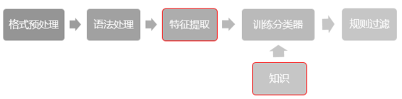

# RITE_zh-CN
Recognizing Inference in Text of Simplified Chinese

## Steps

1. preprocessing with xml and format normalization
2. processing on grammar: segment, pos tagging, named entity recognize
3. extract multifeatures with knowledge
4. send to classifier and train or test
5. post-processing: rule regular



And the modules in code:


## Usage

-  ```shell
   cd ./Source
   python run.py
   ```

-  You can edit `run.py` to train or test any file

   -  Just test the file 'test.txt' and output accuracy and Macro F
      ```python
      if __name__ == '__main__':
          test(prefix='test')
      ```

   -  test a pair of text that  input with user

      ```python
      if __name__ == '__main__':
          test_show()
      ```

   - test the file 'rite_test_new_without_label.txt' and save the predict label

      ```python
      if __name__ == '__main__':
          test_raw_pair(prefix='rite_test_new_without_label')
      ```

   - train with the file 'train.txt'

      ```python
      if __name__ == '__main__':
          train(gamma=0.4, prefix='train')
      ```

      ​